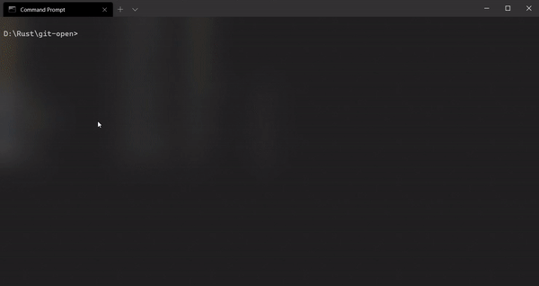

# git-open

<a href="https://crates.io/crates/git-open"></a>


A command line tool to open git project website of the containing repository. Check complete list of arguments [here](https://github.com/KaustubhPatange/git-open/wiki/Command-line-options).



## Installation

The program is available for all major platforms _**Mac, Linux & Windows**_ however the installation procedure might differ.

- [Universal](https://github.com/KaustubhPatange/git-open/wiki/Installation#universal)
- [Windows](https://github.com/KaustubhPatange/git-open/wiki/Installation/#os)
- [Linux](https://github.com/KaustubhPatange/git-open/wiki/Installation/#linux)
- [Mac](https://github.com/KaustubhPatange/git-open/wiki/Installation/#mac)

## Contribute

Contributions are very welcome! See [CONTRIBUTING](CONTRIBUTING.md) for more info.

## License

- [The Apache License Version 2.0](https://www.apache.org/licenses/LICENSE-2.0.txt)

```
Copyright 2020 Kaustubh Patange

Licensed under the Apache License, Version 2.0 (the "License");
you may not use this file except in compliance with the License.
You may obtain a copy of the License at

   https://www.apache.org/licenses/LICENSE-2.0

Unless required by applicable law or agreed to in writing, software
distributed under the License is distributed on an "AS IS" BASIS,
WITHOUT WARRANTIES OR CONDITIONS OF ANY KIND, either express or implied.
See the License for the specific language governing permissions and
limitations under the License.
```
